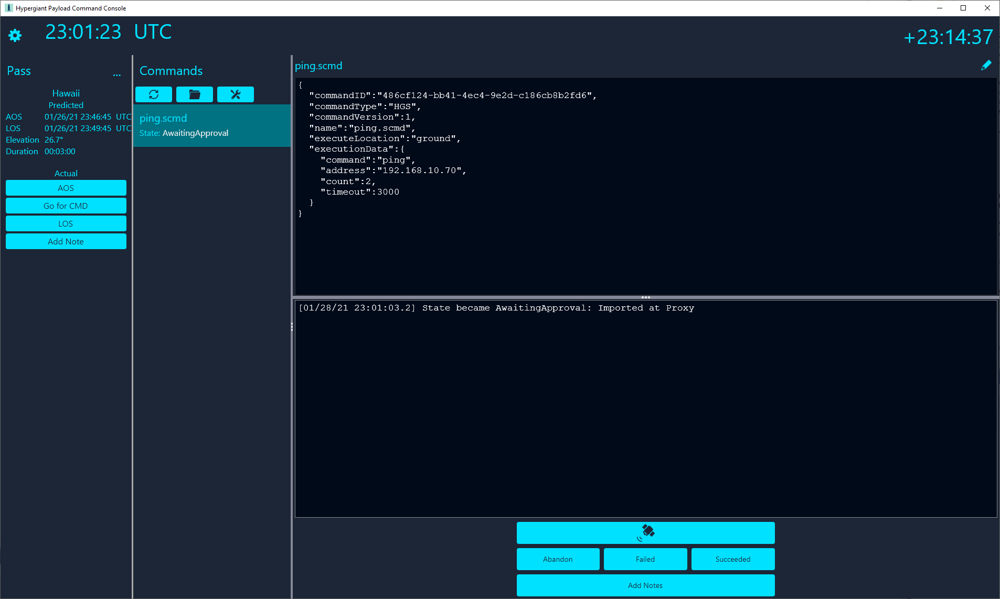

# Hypergiant Payload Command Console

The Payload Command Concole (PCC) is a desktop console application to assist in commanding CubeSats, Cygnus Hosted Payloads and ISS Experiments.

PCC is a .NET 3.1 Core Application that uses the Avalonia UI framework for rendering, and as such should be cross-platform compatible (but currently has been developed and tested only under Windows 10).

PCC is comprised of three larger "systems":

1. The UI Console itself
2. A Storage micro-service
3. A Executive micro-service

## Entities

- GroundStation
- Pass
- PassHistory
- Command
- CommandHistory
- CommandResult

## Payload Command Console



## Proxy Store Service

The purpose of Proxy Store Service is to provide a persistent store for commands and results.

### REST API

```
GET  /api/v1/commands?passid={pass_id} 
    Gets all Commands from the Store associated with a Pass
POST /api/v1/commands
    Inserts a Command into the Store
POST /api/v1/commands/{command_id}/history
    Inserts a History record for a Command into the Store
GET  /api/v1/commands/{command_id}/history
    Retrieves all History records for a Command from the Store

GET  /api/v1/groundstations 
    Gets all Ground Stations from the Store

GET  /api/v1/passes
    Gets all Passes from the Store
GET  /api/v1/passes/{pass_id}
    Gets the specified Pass from the Store
PUT  /api/v1/passes/{pass_id}
    Updates the specified Pass in the Store
POST /api/v1/passes
    Inserts a new Pass into the Store

GET  /api/v1/history/passes/{pass_id}
    Gets all history for the specified Pass
POST /api/v1/history/passes
    Inserts a PassHistory record into the Store
```

## ExecutiveService

The purpose of the Executive Service is to provide an implementation for how Commands get sent to the payload and how Results get retrieved (e.g. CFDP or SCP).

### REST API

```
GET  /api/v1/configuration
    Gets the current Executive configuration
PUT  /api/v1/configuration 
    Updates the current Executive configuration

POST /api/v1/commands
    Sends a Command to the Executive for execution or delivery
```

