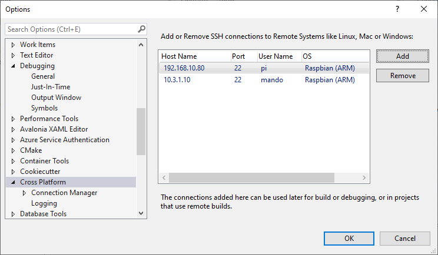
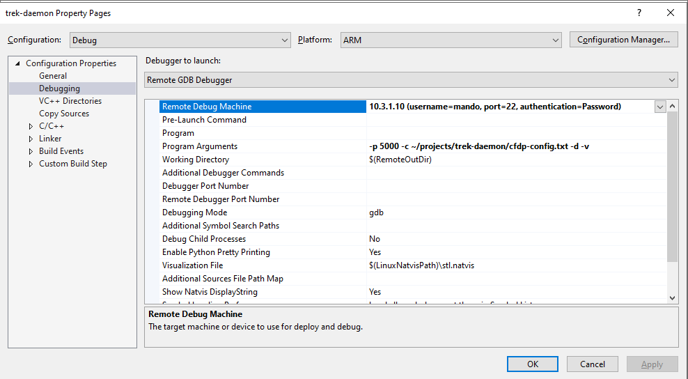
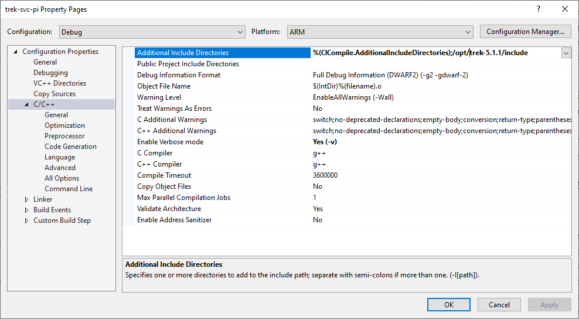
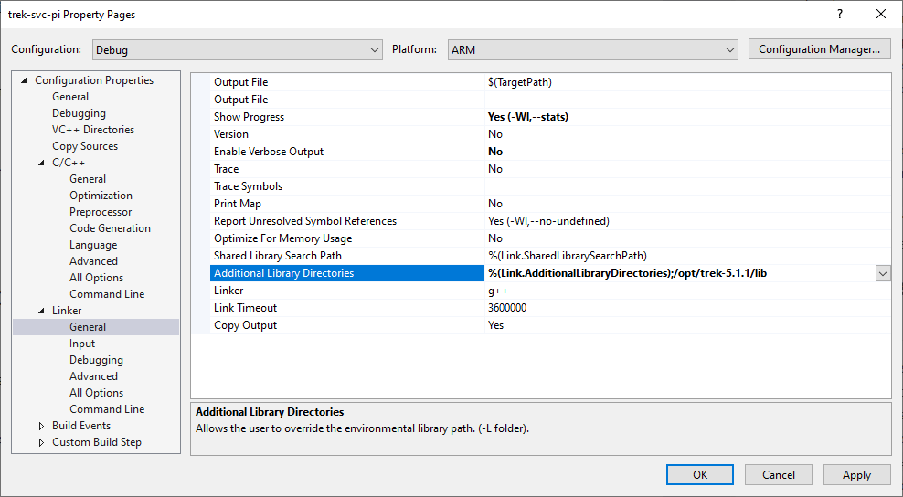

# NASA TReK on Raspberry Pi

Running TReK services on the Raspberry Pi is challenging.  

You can easily run the installed TReK console, but that is relatively useless for anything but testing.

I have not been successful consuming the TReK services from managed code.  I have tried two ways, and both have failed.

## Calling TReK Shared Libraries Directly

The most obvious/typical solution to using TReK from managed code is to naturally P/Invoke the shared libraries.  This works completely as expected on a Windows PC.

On Raspbian it does not.  There is some sort of dynamic load issue that I can't seem to resolve.  It manifests itself like this:

When the code calls the TReK library function `InitToolkitCfdp` I see the following error returned:

```
Failed to load: Unable to load shared library '/opt/trek-5.1.1/lib/libtrek_toolkit_cfdp_api.so' or one of its dependencies. In order to help diagnose loading problems, consider setting the LD_DEBUG environment variable: /opt/trek-5.1.1/lib/libtrek_toolkit_cfdp_api.so: undefined symbol: _ZTIN4trek9BpCollectE
```

I tried turning on `LD_DEBUG` by the following:

```
$ LD_DEBUG=all
$ LD_DEBUG_OUTPUT=ld.txt
```

It's interesting, but not terribly informative.  I see it correctly find the entry point several times when it's looking for it in `libtrek_toolkit_ds_api.so`

```
     23568:	symbol=_ZTIN4trek9BpCollectE;  lookup in file=dotnet [0]
     23568:	symbol=_ZTIN4trek9BpCollectE;  lookup in file=/usr/lib/arm-linux-gnueabihf/libarmmem-v7l.so [0]
     23568:	symbol=_ZTIN4trek9BpCollectE;  lookup in file=/lib/arm-linux-gnueabihf/libpthread.so.0 [0]
     23568:	symbol=_ZTIN4trek9BpCollectE;  lookup in file=/lib/arm-linux-gnueabihf/libdl.so.2 [0]
     23568:	symbol=_ZTIN4trek9BpCollectE;  lookup in file=/usr/lib/arm-linux-gnueabihf/libstdc++.so.6 [0]
     23568:	symbol=_ZTIN4trek9BpCollectE;  lookup in file=/lib/arm-linux-gnueabihf/libm.so.6 [0]
     23568:	symbol=_ZTIN4trek9BpCollectE;  lookup in file=/lib/arm-linux-gnueabihf/libgcc_s.so.1 [0]
     23568:	symbol=_ZTIN4trek9BpCollectE;  lookup in file=/lib/arm-linux-gnueabihf/libc.so.6 [0]
     23568:	symbol=_ZTIN4trek9BpCollectE;  lookup in file=/lib/ld-linux-armhf.so.3 [0]
     23568:	symbol=_ZTIN4trek9BpCollectE;  lookup in file=/opt/trek-5.1.1/lib/libtrek_toolkit_ds_api.so [0]
     23568:	binding file /opt/trek-5.1.1/lib/libtrek_toolkit_ds_api.so [0] to /opt/trek-5.1.1/lib/libtrek_toolkit_ds_api.so [0]: normal symbol `_ZTIN4trek9BpCollectE'
```

But when it looks for it in `libtrek_toolkit_cfdp_api.so` it fails.

```
symbol=_ZTIN4trek9BpCollectE;  lookup in file=dotnet [0]
     23568:	symbol=_ZTIN4trek9BpCollectE;  lookup in file=/usr/lib/arm-linux-gnueabihf/libarmmem-v7l.so [0]
     23568:	symbol=_ZTIN4trek9BpCollectE;  lookup in file=/lib/arm-linux-gnueabihf/libpthread.so.0 [0]
     23568:	symbol=_ZTIN4trek9BpCollectE;  lookup in file=/lib/arm-linux-gnueabihf/libdl.so.2 [0]
     23568:	symbol=_ZTIN4trek9BpCollectE;  lookup in file=/usr/lib/arm-linux-gnueabihf/libstdc++.so.6 [0]
     23568:	symbol=_ZTIN4trek9BpCollectE;  lookup in file=/lib/arm-linux-gnueabihf/libm.so.6 [0]
     23568:	symbol=_ZTIN4trek9BpCollectE;  lookup in file=/lib/arm-linux-gnueabihf/libgcc_s.so.1 [0]
     23568:	symbol=_ZTIN4trek9BpCollectE;  lookup in file=/lib/arm-linux-gnueabihf/libc.so.6 [0]
     23568:	symbol=_ZTIN4trek9BpCollectE;  lookup in file=/lib/ld-linux-armhf.so.3 [0]
     23568:	symbol=_ZTIN4trek9BpCollectE;  lookup in file=/opt/trek-5.1.1/lib/libtrek_toolkit_cfdp_api.so [0]
     23568:	symbol=_ZTIN4trek9BpCollectE;  lookup in file=/usr/lib/arm-linux-gnueabihf/libstdc++.so.6 [0]
     23568:	symbol=_ZTIN4trek9BpCollectE;  lookup in file=/lib/arm-linux-gnueabihf/libm.so.6 [0]
     23568:	symbol=_ZTIN4trek9BpCollectE;  lookup in file=/lib/arm-linux-gnueabihf/libc.so.6 [0]
     23568:	symbol=_ZTIN4trek9BpCollectE;  lookup in file=/lib/arm-linux-gnueabihf/libgcc_s.so.1 [0]
     23568:	symbol=_ZTIN4trek9BpCollectE;  lookup in file=/lib/ld-linux-armhf.so.3 [0]
     23568:	/opt/trek-5.1.1/lib/libtrek_toolkit_cfdp_api.so: error: symbol lookup error: undefined symbol: _ZTIN4trek9BpCollectE (fatal)
```

Seems nonsensical.

Using `readelf` on the two libraries confirms that the symbol does not exist in the `cfdp_api.so` lib, but does exist in the `ds_api.so` lirary:

```
 446: 000aa098    24 OBJECT  GLOBAL DEFAULT   19 _ZTIN4trek9BpCollectE
```

I *have* adding the TReK lib folder to both the `LD_LIBRARY_PATH` and by directly adding to `/etc/ld.so.conf`, neither of which fixed the problem.

## Calling the TReK Libraries from a native compiled library

As an attempt to work around the above problem, I created my own native (C/C++) shared library (`trek-svc`) that is effectively a REST server that wraps up the CFDP pieces.  The idea being that this library would make all calls to the TReK libraries and the managed code would simply make a few calls into exposed entry points like `StartServer()` and `StopServer()`.  

Running this way obfuscates errors, but when the application calls `InitToolkitCfdp` it gets a return value of `50004` which translates to `DS_LIBRARY_LOAD_ERROR` which feels like the same problem is occurring, it's just been shifted to the native side of the house.

## Running TReK as a Stand-alone App

The current "solution" is to just compile a fully native REST serer application that consumes the trek libraries.  This *works* which I don't fully understand.  The only real difference is the entry point - one is the `dotnet` runtime binary, the other is a simple `trek-daemon` binary.

## Building the Libraries

I am building using a Windows 10 machine running Visual Studio and a Raspberry Pi 4B

Visual Studio is just a conduit to the build, the actual compiling happens on-device (so it's not cross-compiled).

Setting up remote compiling and debugging is not intuitive in Studio, so here is what you need to know:

### Adding a Remote Target to Visual Studio

Open *Tools->Options* from the menu*.  Under `Cross Platform` add in your target device info.



### Update All Native Project Settings

You must update *all* of the native projects (currently `tre-daemon` and `trek-svc-pi`) to use that target:



If you compile, it's quite possible you will see missing file errors like this

```
Error		toolkit_ds_api_ansi_c.h: No such file or directory
 #include "toolkit_ds_api_ansi_c.h"
          ^~~~~~~~~~~~~~~~~~~~~~~~~
```

This is because you must set up the remote include and library paths for the project as well.

In the settings for the both projects, add the additional paths *as they are found on your target device*.




## Compiler Output

Once compiled, the binary will be on the target Raspberry Pi.  Currently it will end up at

`~/projects/trek-daemon/bin/ARM/Debug/trek-daemon.out` (or Release)

You can adjust the project settings if you want something else, but be aware that the solution is set up to also remote debug.  If you change the output location, you need to also change the inputs for debugging to match.

## Installing the TReK Service

Before executing the TReK Service, it's preferred to rename the binary to just `trek-daemno` (omitting the compiler-created suffix).

```
$ sudo mkdir /opt/hive/trek-daemon
$ sudo chmod 777 /opt/hive/trek-daemon/
$ sudo cp {source of trek-daemon.out} /opt/hive/trek-daemon/trek-daemon
$ sudo cp {source of cfdp-config.txt} /opt/hive/trek-daemon/cfdp-config.txt
```

Ensure you edit the `cfdp-config.txt` file and set the addresses, ports and entity IDs to reflect your actual installation topology.

```
# Local entity ID node.
local_entity_id 100 local_ip_address 10.3.1.10 local_port 4560

# Remote entity ID nodes.
remote_entity_id 1 remote_ip_address 10.3.1.100 remote_port 4560
```

## Running the TReK Service


### Command Line

The TReK Service accepts several command-line parameters:

`$ trek-daemon -p 5000 -c cfdp-config.txt -d -v`

| Parameter | Description |
| --- | --- |
| `-p` | TCP Port the server listens on.  Default is 5000 |
| `-c` | Path to TReK configuration file.  Default is 'cfdp-config.txt' |
| `-d` | Use when running as a daemon. When present the service generates a lock file (`/servers/cfdp/`) and opens the system log (`cfdp`). |
| `-v` | Verbose mode.  Server outputs runtime information when enabled. |

### Running as a Daemon

[TBD]

## REST Interface

### Parameters
Parameters required by individual APIs are passed in the _body_ of ther request as JSON.  For example, the body for a GET might look like this:

```
{
	"localFile":"/opt/hive/trek-daemon/cfdp-config.txt",
	"remoteFile":"c:\\temp\\trek\\test.txt",
	"remoteEntityID":1
}
```

### API Endpoints
```
{address}/api
	GET     Used to detect if the server is running.  Returns a 200 with the server's current configuration file as the body

{address}/api/cfdp
	GET     Does a CLASS_2 CFDP GET of a file from a remote (i.e. not the RasPi) device.            
            BODY PARAMETERS
            localFile       required    Full path name to the local destination file to create
            remoteFile      required    Full path to the remote source file for the transfer
            remoteEntityID  required    CFDP Entity ID of the remote file source
	POST    Does a CLASS_2 CFDP PUT of a file to a remote (i.e. not the RasPi) device.
            BODY PARAMETERS
            localFile       required    Full path name to the local source file to create
            remoteFile      required    Full path to the remote destination file for the transfer
            remoteEntityID  required    CFDP Entity ID of the remote file destination
	DELETE  Does a CLASS_2 CFDP DELETE of a file from a remote (i.e. not the RasPi) device.
            BODY PARAMETERS
            remoteFile      required    Full path to the remote file to delete
            remoteEntityID  required    CFDP Entity ID of the remote file source
    
```